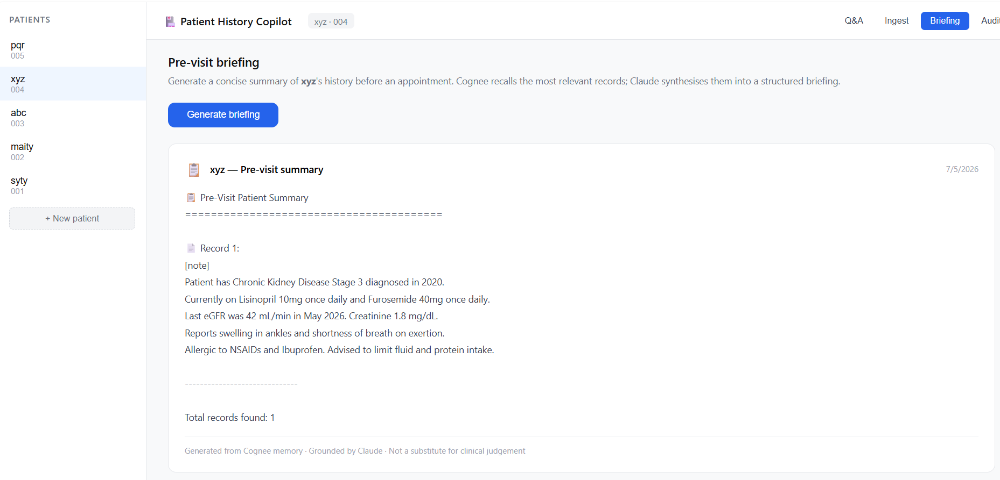

# 🏥 Patient History Copilot


An AI-powered clinical assistant that gives doctors **instant, conversational access to a patient's complete medical history**. Ask *"What medications is this patient on?"*, *"Has this patient reported chest pain before?"*, or *"Summarise everything before my 2pm appointment"* — and get answers grounded in the patient's actual records.

---

## 🎥 Demo



---

## 💡 The Problem

Doctors waste valuable time digging through old records before every appointment. Critical patient context gets lost between visits, scattered across PDFs, paper notes, and disconnected systems. Most AI tools forget everything the moment the session ends.

**Patient History Copilot gives AI a persistent memory — so doctors never have to repeat themselves.**

---

## ✨ Features

- **Natural language Q&A** — Ask anything about a patient's history in plain English
- **Document ingestion** — Upload PDFs or paste text notes directly
- **Pre-visit briefing** — One-click summary before every appointment
- **PII redaction** — Microsoft Presidio strips names, dates, and identifiers before storage
- **Per-patient isolation** — Each patient's data lives in its own memory space
- **GDPR erasure** — Permanently delete all memory for a patient with one click
- **Audit trail** — Every memory read and write is logged

---

## 🛠️ Tech Stack

| Layer | Technology |
|---|---|
| Backend | FastAPI (Python) |
| Frontend | React + Vite |
| Memory | SQLite (local) / Cognee (production) |
| PII Redaction | Microsoft Presidio |
| PDF Parsing | PyMuPDF |
| Audit Logging | JSONL |

---

## 🚀 Getting Started

### Prerequisites

- Python 3.12 (recommended — not 3.13)
- Node.js 18+

### Installation

```bash
# Clone the repo
git clone https://github.com/Soumya9107/patient-history-copilot.git
cd patient-history-copilot
```

### Backend Setup

```bash
# Create and activate virtual environment
python -m venv venv
venv\Scripts\activate        # Windows
source venv/bin/activate     # Mac/Linux

# Install dependencies
pip install fastapi uvicorn[standard] python-multipart anthropic pydantic-settings aiofiles python-dotenv pymupdf presidio-analyzer presidio-anonymizer

# Copy environment variables
cp .env.example .env
```

### Environment Variables

Fill in your `.env` file:

```env
ANTHROPIC_API_KEY=not_used
GEMINI_API_KEY=not_used
APP_ENV=development
SECRET_KEY=your_random_secret_key_here
ALLOWED_ORIGINS=http://localhost:5173,http://localhost:3000
PII_REDACTION_ENABLED=false
AUDIT_LOG_ENABLED=true
```

### Run the Backend

```bash
cd backend
uvicorn main:app --reload
```

Backend runs at `http://localhost:8000`
API docs at `http://localhost:8000/docs`

### Frontend Setup

Open a new terminal:

```bash
cd frontend
npm install
npm run dev
```

Frontend runs at `http://localhost:5173`

---

## 📁 Project Structure

```
patient-history-copilot/
├── backend/
│   ├── api/
│   │   ├── ingest.py        # Document ingestion endpoints
│   │   ├── recall.py        # Q&A and briefing endpoints
│   │   └── patients.py      # Patient management + GDPR erase
│   ├── core/
│   │   ├── cognee_client.py # Memory layer (SQLite/Cognee)
│   │   ├── claude_client.py # LLM client (stubbed for demo)
│   │   ├── pii_redaction.py # Presidio PII pipeline
│   │   ├── pdf_parser.py    # PyMuPDF extraction
│   │   ├── audit.py         # Audit logger
│   │   └── config.py        # App configuration
│   ├── main.py              # FastAPI entry point
│   └── requirements.txt
├── frontend/
│   ├── src/
│   │   ├── components/
│   │   │   ├── PatientSidebar.jsx   # Patient list + add new
│   │   │   ├── ChatInterface.jsx    # Q&A chat UI
│   │   │   ├── IngestPanel.jsx      # Document upload UI
│   │   │   ├── Briefing.jsx         # Pre-visit summary UI
│   │   │   └── AuditLog.jsx         # Audit trail + GDPR erase
│   │   ├── App.jsx
│   │   └── main.jsx
│   ├── index.html
│   └── package.json
├── .env.example
└── README.md
```

---

## 🔄 How It Works

```
Medical Document (PDF / text)
        ↓
  PII Redaction (Presidio)
        ↓
  Memory Store (SQLite / Cognee)
        ↓
  Keyword / Semantic Search
        ↓
  Doctor's UI (raw recalled records)
```

---

## 🧪 Demo Data

Use these sample records to test the app. Create a patient in the sidebar, go to the **Ingest** tab, paste as text, and click **Ingest**:

**Patient P-001 — Type 2 Diabetes:**
```
Patient diagnosed with Type 2 Diabetes in 2019. Currently on Metformin 500mg
twice daily and Glipizide 5mg once daily. Last HbA1c was 7.4% in April 2026.
Blood pressure 138/88. Reports occasional dizziness and fatigue.
No known drug allergies. BMI 28.4.
```

**Patient P-002 — Hypertension + Hypothyroidism:**
```
Patient has Hypertension diagnosed in 2021 and Hypothyroidism since 2018.
Currently on Amlodipine 5mg once daily and Levothyroxine 50mcg every morning.
Last TSH level was 3.2 mIU/L in March 2026. Blood pressure 142/90.
Reports mild headaches and weight gain. Allergic to Penicillin.
```

Then ask questions like:
- *"What medications is this patient on?"*
- *"Any known allergies?"*
- *"What was the last lab result?"*

---

## 📖 Blog Post

Read the full build story here: _[[Blog link](https://hashnode.com/edit/cmr84vguj000009ja19b79gpy)]_

---

## 🔗 Repository

[https://github.com/Soumya9107/patient-history-copilot](https://github.com/Soumya9107/patient-history-copilot)

---

## ⚠️ Disclaimer

This project is a **hackathon prototype** and is not a certified medical device. It should not be used for real clinical decision-making without appropriate validation and regulatory clearance.

---

## 🤝 Contributing

PRs welcome! Please open an issue first to discuss changes.

---

## 📄 License

MIT
